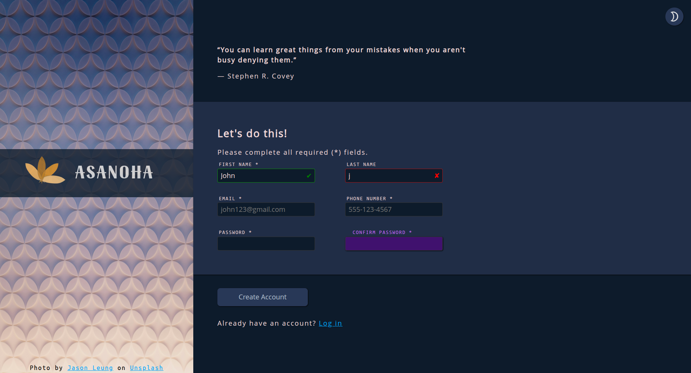
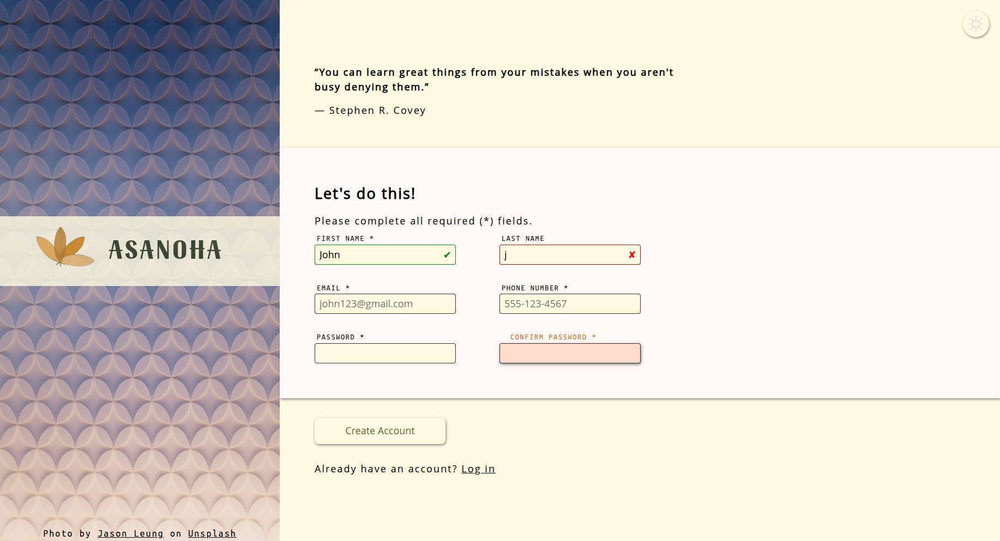

# sign-up-form
**A sign up form built using mainly CSS and HTML (with a little bit JS for switching themes)**
## Preview

## Features
 - **2 themes dark & light** (you can switch between them using the button at the right top corner)
 - Nice colors
 - Hovering / focusing smooth effects
 - Validating forms using HTML built-in tools (no JS)
 - Styling form validation

 ## How to run 
 [Live preview](https://abdulwhab-elghareeb.github.io/sign-up-form/)

 ## Credit
 Switching modes button : 
  - Sun symbol : [Google fonts](https://fonts.google.com/icons?selected=Material+Symbols+Outlined:sunny:FILL@0;wght@400;GRAD@0;opsz@24&icon.size=24&icon.color=%23e3e3e3&icon.platform=web)

  - Moon symbol : [Google fonts](https://fonts.google.com/icons?selected=Material+Symbols+Outlined:mode_night:FILL@0;wght@400;GRAD@0;opsz@24&icon.size=24&icon.color=%23e3e3e3&icon.platform=web&icon.query=moon)

  - Card picture : [Unsplash - Jason Leung](https://unsplash.com/photos/a-blue-and-white-abstract-background-with-circles-UMncYEfO9-U)